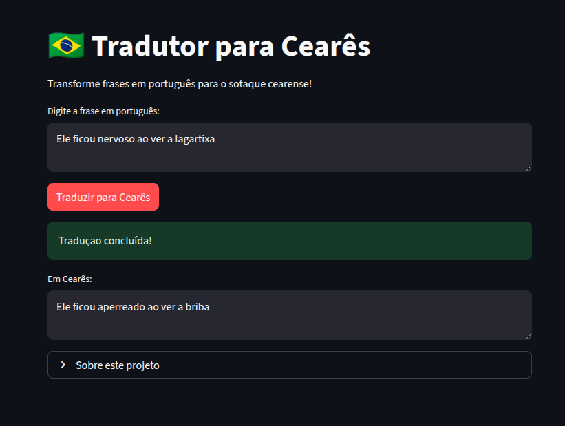

# Cearês Translator Challenge <!-- omit in toc -->

- [Sobre](#sobre)
- [Como Executar](#como-executar)
  - [Clone o repositório](#clone-o-repositório)
  - [Criar ambiente Python](#criar-ambiente-python)
  - [Ativar ambiente Python](#ativar-ambiente-python)
- [Executar localmente](#executar-localmente)
  - [Treinar o modelo](#treinar-o-modelo)
  - [Executar tela com streamlit](#executar-tela-com-streamlit)
- [Publicar](#publicar)
- [Links](#links)

## Sobre

Este modelo é uma versão *fine-tuned* do GPT-2 em português para o sotaque cearense.

Esse tradutor utiliza IA para converter frases em português padrão para o sotaque cearense, usando um modelo GPT-2 fine-tuned.

Exemplos:

- "Esse rapaz é bobo" → "Esse rapaz é abestado"
- "Ele ficou nervoso ao ver a lagartixa" → "Ele ficou aperreado ao ver a briba"
- "João é teimoso" → "João é tabaréu!"
- "Aquele menino gosta de mexer nas coisas" → "Aquele sibite baleado gosta de futricar nas coisas"



## Como Executar

### Clone o repositório

```bash
git git@github.com:jacksoncastro/hugging-challenge.git
cd hugging-challenge
```

### Criar ambiente Python

```bash
python -m venv .venv
```

### Ativar ambiente Python

```bash
source .venv/bin/activate
```

## Executar localmente

> Antes de executar, copie `.env.sample` e renomeie para `.env`. Substitua as variáveis ​​pelos valores corretos.

Instale as dependências:

```bash
pip install -r requirements.txt
```

### Treinar o modelo

```bash
python src/main.py
```

### Executar tela com streamlit

```bash
python -m streamlit run src/app.py
```

Acesse <http://localhost:8501>

## Publicar

Para publicar o modelo no [huggingface](https://huggingface.co/jacksoncastro/ceares) execute:

```bash
python src/hugging.py
```

## Links

- [huggingface](https://huggingface.co/jacksoncastro/ceares)
- [streamlit.io](https://ceares.streamlit.app)
